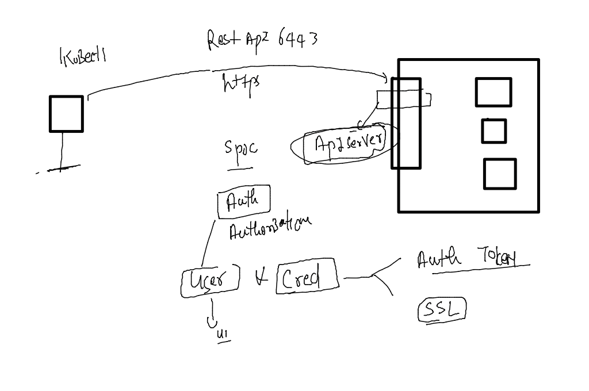
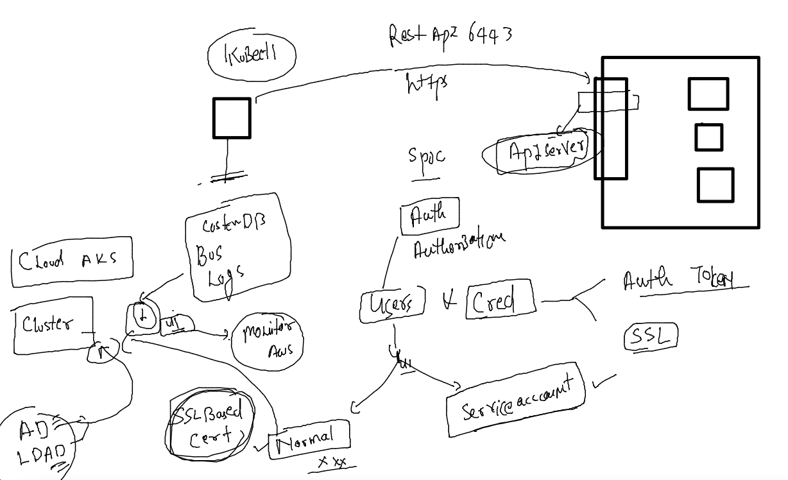
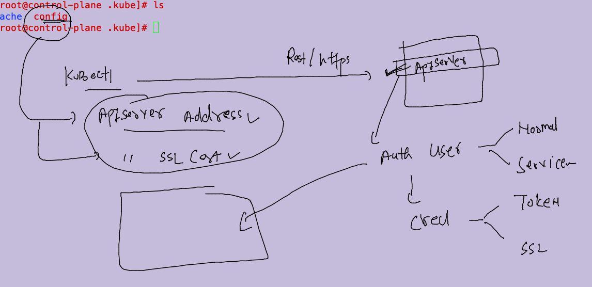
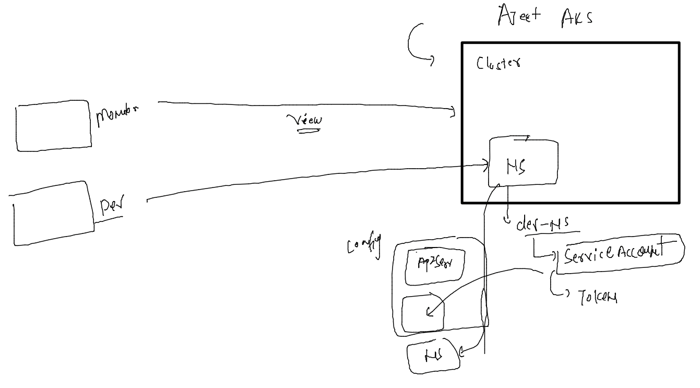

# aks-cka-training

## RBAC & Users in k8s 

### understanding auth process 



### users in k8s 



### data of config file 



### config file 

```
[root@control-plane ~]# kubectl  config view 
apiVersion: v1
clusters:
- cluster:
    certificate-authority-data: DATA+OMITTED
    server: https://172.31.4.111:6443
  name: kubernetes
contexts:
- context:
    cluster: kubernetes
    user: kubernetes-admin
  name: kubernetes-admin@kubernetes
current-context: kubernetes-admin@kubernetes
kind: Config
preferences: {}
users:
- name: kubernetes-admin
  user:
    client-certificate-data: REDACTED
    client-key-data: REDACTED
[root@control-plane ~]# kubectl  config view  --raw 
apiVersion: v1
clusters:
- cluster:

```

### service account details sharing 



