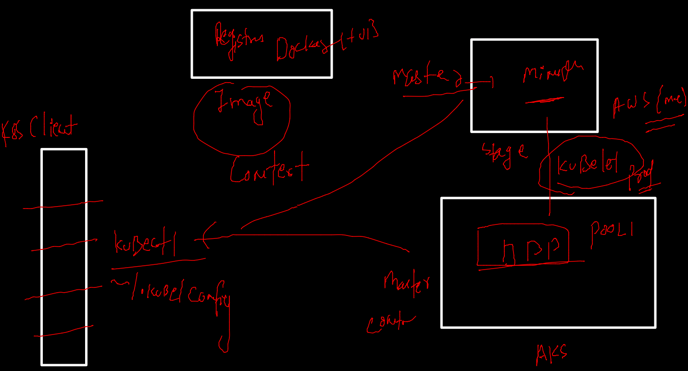
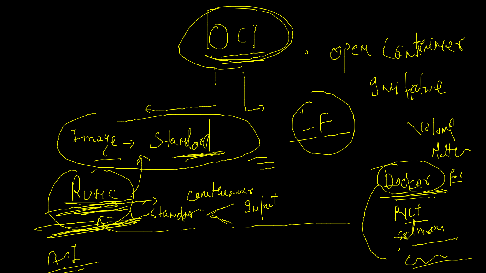

# aks-cka-training

## k8s client to cluster connection 



## OCI  



### auto generate yaml 

```
kubectl run  ashupod2  --image=alpine --dry-run=client -o yaml 
apiVersion: v1
kind: Pod
metadata:
  creationTimestamp: null
  labels:
    run: ashupod2
  name: ashupod2
spec:
  containers
  
===
kubectl run  ashupod2  --image=alpine --dry-run=client -o yaml  >ashupod2.yaml

```

### JSOn 

```
kubectl run  ashupod2  --image=alpine --dry-run=client -o json 

```

### multi container POd--

```
fire@ashutoshhs-MacBook-Air k8syamls % ls
ashupod1.yaml   ashupod2.yaml
fire@ashutoshhs-MacBook-Air k8syamls % kubectl  apply -f  ashupod2.yaml 
pod/ashupod2 created
fire@ashutoshhs-MacBook-Air k8syamls % kubectl get pods
NAME       READY   STATUS    RESTARTS   AGE
ashupod2   2/2     Running   0          4s

```

### accessing container shell

```
fire@ashutoshhs-MacBook-Air ~ % kubectl get  po
NAME        READY   STATUS    RESTARTS   AGE
ajeetpod1   2/2     Running   0          3m59s
ashupod2    2/2     Running   0          4m30s
surbhi16    2/2     Running   0          2m48s
fire@ashutoshhs-MacBook-Air ~ % kubectl  exec  -it  ashupod2  -- bash 
Defaulted container "ashuc2" out of: ashuc2, ashupod2
root@ashupod2:/# 
root@ashupod2:/# 
root@ashupod2:/# cat  /etc/os-release 
PRETTY_NAME="Debian GNU/Linux 11 (bullseye)"
NAME="Debian GNU/Linux"
VERSION_ID="11"
VERSION="11 (bullseye)"
VERSION_CODENAME=bullseye
ID=debian
HOME_URL="https://www.debian.org/"
SUPPORT_URL="https://www.debian.org/support"
BUG_REPORT_URL="https://bugs.debian.org/"
root@ashupod2:/# exit
exit
fire@ashutoshhs-MacBook-Air ~ % kubectl  exec  -it  ashupod2 -c ashupod2    -- sh   
/ # cat /etc/os-release 
NAME="Alpine Linux"
ID=alpine
VERSION_ID=3.15.0
PRETTY_NAME="Alpine Linux v3.15"
HOME_URL="https://alpinelinux.org/"
BUG_REPORT_URL="https://bugs.alpinelinux.org/"
/ # exit


```

### deleting pod 

```
kubectl apply -f  ashupod2.yaml 
pod/ashupod2 created
fire@ashutoshhs-MacBook-Air k8syamls % kubectl get pods
NAME       READY   STATUS    RESTARTS   AGE
ashupod2   2/2     Running   0          109s
fire@ashutoshhs-MacBook-Air k8syamls % kubectl delete pod ashupod2
pod "ashupod2" deleted
fire@ashutoshhs-MacBook-Air k8syamls % kubectl get pods
No resources found in default namespace.
fire@ashutoshhs-MacBook-Air k8syamls % kubectl delete  -f  ashupod2.yaml


```

### k8s networking 

## pre-requisite 


