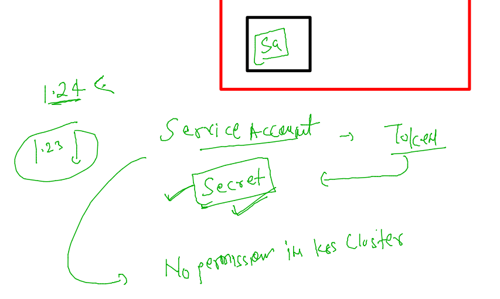
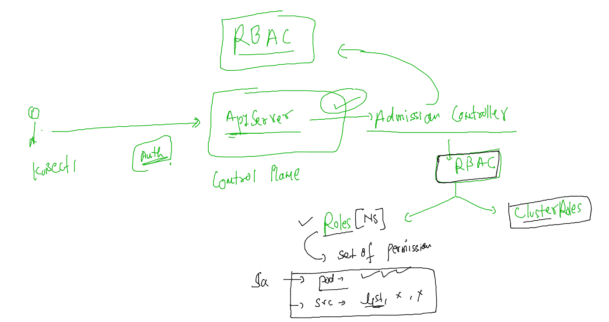

# aks-cka-training

## RBAC & Users in k8s 

### understanding auth process 


### users in k8s 


### data of config file 


### config file 

```
[root@control-plane ~]# kubectl  config view 
apiVersion: v1
clusters:
- cluster:
    certificate-authority-data: DATA+OMITTED
    server: https://172.31.4.111:6443
  name: kubernetes
contexts:
- context:
    cluster: kubernetes
    user: kubernetes-admin
  name: kubernetes-admin@kubernetes
current-context: kubernetes-admin@kubernetes
kind: Config
preferences: {}
users:
- name: kubernetes-admin
  user:
    client-certificate-data: REDACTED
    client-key-data: REDACTED
[root@control-plane ~]# kubectl  config view  --raw 
apiVersion: v1
clusters:
- cluster:

```

### service account details sharing 


### creating ns 

```
[root@control-plane ~]# kubectl create  ns  ajeet-work 
namespace/ajeet-work created
[root@control-plane ~]# kubectl create  ns  manoj-mon 
namespace/manoj-mon created
[root@control-plane ~]# kubectl  get  ns
NAME              STATUS   AGE
ajeet-work        Active   18s
default           Active   20d
ingress-nginx     Active   6d23h
kube-node-lease   Active   20d
kube-public       Active   20d
kube-system       Active   20d
manoj-mon         Active   7s
surbhi-project    Active   4d23h
```
### now time for creating secret for service account 

```
apiVersion: v1
kind: Secret
type: kubernetes.io/service-account-token
metadata:
  name: surbhi-sec
  namespace: surbhi-project
  annotations:
    kubernetes.io/service-account.name: "default"
```

### creating 

```
kubectl apply -f sa-secret.yaml 
secret/surbhi-sec created
[root@control-plane auth]# kubectl  get secret  -n surbhi-project 
NAME         TYPE                                  DATA   AGE
surbhi-sec   kubernetes.io/service-account-token   3      6s
```
### how to get token from secret 

```
kubectl describe  secret  surbhi-sec   -n surbhi-project 
Name:         surbhi-sec
Namespace:    surbhi-project
Labels:       <none>
Annotations:  kubernetes.io/service-account.name: default
              kubernetes.io/service-account.uid: 3a6c423c-d46d-4e45-b171-1ee607e8dc9a

Type:  kubernetes.io/service-account-token

Data
====
namespace:  14 bytes
token:      eyJhbGciOiJSUzI1NiIsImtpZCI6IjczUWlWeC1JVzVVRDVpMEotVnNUaUI5VEs2N0R3TDU2ZnVLZ2pqd19kOEEifQ.eyJpc3MiOiJrdWJlcm5ldGVzL3NlcnZpY2VhY2NvdW50Iiwia3ViZXJuZXRlcy5pby9zZXJ2aWNlYWNjb3VudC9uYW1lc3BhY2UiOiJzdXJiaGktcHJvamVjdCIsImt1YmVybmV0ZXMuaW8vc2VydmljZWFjY291bnQvc2VjcmV0Lm5hbWUiOiJzdXJiaGktc2VjIiwia3ViZXJuZXRlcy5pby9zZXJ2aWNlYWNjb3VudC9zZXJ2aWNlLWFjY291bnQubmFtZSI6ImRlZmF1bHQiLCJrdWJlc
```

### no permission is assign to service in k8s by default 



### RBAC 



### creating roles 

### commands 

```
142  kubectl  create  role  pod-perms  --resource=pods --verb=create,get,list,delete             --dry-run=client -o yaml 
  143  kubectl  create  role  pod-perms  --resource=pods --verb=create,get,list,delete             --dry-run=client -o yaml >surbhi_roles.yaml 
```
### yaml 
```
[root@control-plane auth]# cat surbhi_roles.yaml 
apiVersion: rbac.authorization.k8s.io/v1
kind: Role
metadata:
  creationTimestamp: null
  name: pod-perms
rules:
- apiGroups:
  - ""
  resources:
  - pods
  verbs:
  - create
  - get
  - list
  - delete

--- 
apiVersion: rbac.authorization.k8s.io/v1
kind: Role
metadata:
  creationTimestamp: null
  name: svc-perms
rules:
- apiGroups:
  - ""
  resources:
  - services
  verbs:
  - get
  - list

```

###

```
 kubectl create -f surbhi_roles.yaml  -n surbhi-project 
role.rbac.authorization.k8s.io/pod-perms created
role.rbac.authorization.k8s.io/svc-perms created
[root@control-plane auth]# 
[root@control-plane auth]# kubectl  get roles   -n surbhi-project 
NAME        CREATED AT
pod-perms   2022-06-21T02:33:45Z
svc-perms   2022-06-21T02:33:45Z
```

### creating rolebinds to bind role to sa 

```
[root@control-plane auth]# kubectl  create rolebinding  bind1  --role=pod-perms  --serviceaccount=surbhi-project:default --dry-run=client  -o yaml 
apiVersion: rbac.authorization.k8s.io/v1
kind: RoleBinding
metadata:
  creationTimestamp: null
  name: bind1
roleRef:
  apiGroup: rbac.authorization.k8s.io
  kind: Role
  name: pod-perms
subjects:
- kind: ServiceAccount
  name: default
  namespace: surbhi-project
[root@control-plane auth]# kubectl  create rolebinding  bind1  --role=pod-perms  --serviceaccount=surbhi-project:default --dry-run=client  -o yaml  >bind1.yaml 
[root@control-plane auth]# 
[root@control-plane auth]# kubectl  create rolebinding  bind2  --role=svc-perms  --serviceaccount=surbhi-project:default --dry-run=client  -o yaml  >>bind1.yaml 
[root@control-plane auth]# 
[root@control-plane auth]# vim bind1.yaml 
[root@control-plane auth]# kubectl create -f  bind1.yaml -n surbhi-project 
rolebinding.rbac.authorization.k8s.io/bind1 created
rolebinding.rbac.authorization.k8s.io/bind2 created
[root@control-plane auth]# 
[root@control-plane auth]# kubectl  get roles -n surbhi-project 
NAME        CREATED AT
pod-perms   2022-06-21T02:33:45Z
svc-perms   2022-06-21T02:33:45Z
[root@control-plane auth]# kubectl  get rolebinding  -n surbhi-project 
NAME    ROLE             AGE
bind1   Role/pod-perms   13s
bind2   Role/svc-perms   13s
[root@control-plane auth]# kubectl  get sa  -n surbhi-project 
NAME      SECRETS   AGE
default   0         4d23h

```


