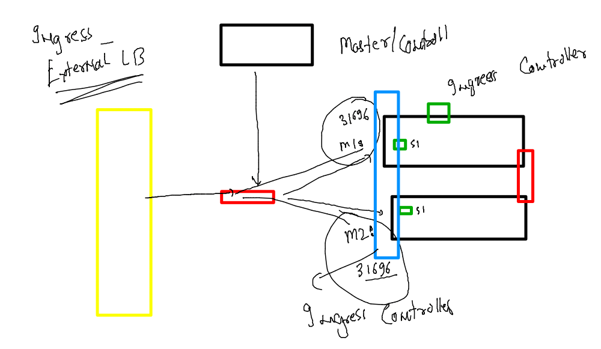

# aks-cka-training

### deploy Nginx ingress controller 

[LInk]()

```
kubectl apply -f https://raw.githubusercontent.com/kubernetes/ingress-nginx/controller-v1.2.0/deploy/static/provider/baremetal/deploy.yaml

```

### Ingress Lb 



### verify 

```
kubectl get  ns
NAME              STATUS   AGE
default           Active   3d
ingress-nginx     Active   96s
kube-node-lease   Active   10h
kube-public       Active   3d
kube-system       Active   3d
[root@master ~]# kubectl get  po -n  ingress-nginx 
NAME                                        READY   STATUS      RESTARTS   AGE
ingress-nginx-admission-create-dxrg5        0/1     Completed   0          112s
ingress-nginx-admission-patch-9fv9g         0/1     Completed   0          112s
ingress-nginx-controller-6b864cf6dd-w47zw   1/1     Running     0          112s
[root@master ~]# kubectl get  svc  -n  ingress-nginx 
NAME                                 TYPE        CLUSTER-IP       EXTERNAL-IP   PORT(S)                      AGE
ingress-nginx-controller             NodePort    10.104.54.111    <none>        80:31696/TCP,443:31269/TCP   2m16s
ingress-nginx-controller-admission   ClusterIP   10.109.144.108   <none>        443/TCP                      2m16s
[root@master ~]# 

```

### usage of Ingress controller 

### there are 5 customers who are deploying their application as pod 

```
kubectl run ashuwebapp1  --image=dockerashu/ingresstest:ashuv1  --port 80 
pod/ashuwebapp1 created
[root@master images]# kubectl get  po
NAME          READY   STATUS    RESTARTS   AGE
ashuwebapp1   1/1     Running   0          6s
[root@master images]# 

```

### creating service for ashutoshh 

```
kubectl expose pod  ashuwebapp1  --port 80  --name ashuinternal-lb1
service/ashuinternal-lb1 exposed
[root@master images]# kubectl get  svc
NAME               TYPE        CLUSTER-IP     EXTERNAL-IP   PORT(S)   AGE
ashuinternal-lb1   ClusterIP   10.97.28.168   <none>        80/TCP    5s
kubernetes         ClusterIP   10.96.0.1      <none>        443/TCP   28m
```
### creating ingress rule 

```
kubectl create -f  ashuroute.yaml 
ingress.networking.k8s.io/ashu-app-rule created
[root@master ~]# cat ashuroute.yaml 
apiVersion: networking.k8s.io/v1
kind: Ingress
metadata:
  name: ashu-app-rule
  annotations:
    nginx.ingress.kubernetes.io/rewrite-target: /
spec:
  ingressClassName: nginx
  rules:
  - host: www.ashu.com # this is my domain name 
    http:
      paths:
      - path: / # my website is having only single / home page 
        pathType: Prefix
        backend:
          service:
            name: ashuinternal-lb1  # name of service for ashu app 
            port:
              number: 80
[root@master ~]# kubectl get  ingress
NAME            CLASS   HOSTS           ADDRESS        PORTS   AGE
ashu-app-rule   nginx   www.ashu.com                   80      12s
manoj-rt-rule   nginx   www.manoj.com   172.31.89.51   80      68s
```
### history 

```
131  kubectl get  ingress
  132  kubectl get po,svc
  133  kubectl get ig
  134  kubectl get ingress
  135  host ingress-load-balancer-1832527989.us-east-1.elb.amazonaws.com
  136  kubectl get ingress
  137  kubectl get ingress manoj-rt-rule  -oyaml
  138  cat  ashuroute.yaml 
  139  kubectl get  ingress
  140  cat  ashuroute.yaml 
  141  cp ashuroute.yaml rul1.yaml
  142  vim rul1.yaml 
  143  kubectl create -f rul1.yaml 
  144  vim rul1.yaml 
  145  kubectl create -f rul1.yaml 
  146  kubectl get ingress
  147  cat rul1.yaml 
  148  kubectl get ingress
```


