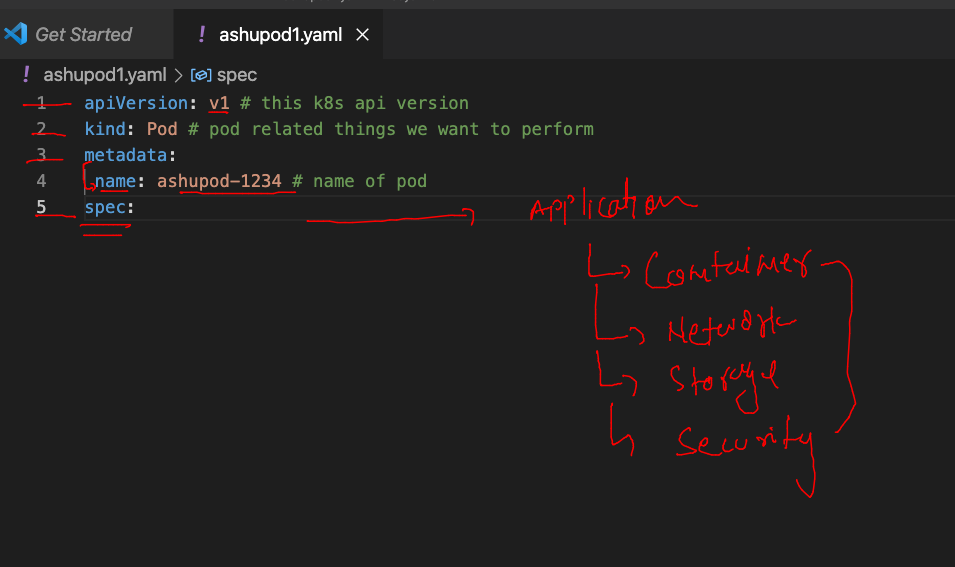

# aks-cka-training

## POd Designing 



### creating pod and checking 

```
 ls
ashupod1.yaml
fire@ashutoshhs-MacBook-Air k8syamls % kubectl  apply -f ashupod1.yaml --dry-run=client 
pod/ashupod-1234 created (dry run)
fire@ashutoshhs-MacBook-Air k8syamls % 
```

### sending request to apiserver for pod deployment 

```
 kubectl  apply -f ashupod1.yaml 
pod/ashupod-1234 created
fire@ashutoshhs-MacBook-Air k8syamls % kubectl get  pods               
NAME           READY   STATUS    RESTARTS   AGE
ajeetpod       1/1     Running   0          17s
ashupod-1234   1/1     Running   0          2s
fire@ashutoshhs-MacBook-Air k8syamls % 
```

### POd1 details 

```
% kubectl get po -o wide
NAME            READY   STATUS    RESTARTS   AGE     IP                NODE                           NOMINATED NODE   READINESS GATES
ajeetpod        1/1     Running   0          13m     192.168.203.217   ip-172-31-85-52.ec2.internal   <none>           <none>
ashupod-1234    1/1     Running   0          13m     192.168.203.218   ip-172-31-85-52.ec2.internal   <none>           <none>
manojpod-1234   1/1     Running   0          8m50s   192.168.203.219   ip-172-31-85-52.ec2.internal   <none>           <none>
surbhi16        1/1     Running   0          55s     192.168.203.2
```

### more info about POD

```
ire@ashutoshhs-MacBook-Air k8syamls % kubectl  describe pod surbhi16
Name:         surbhi16
Namespace:    default
Priority:     0
Node:         ip-172-31-85-52.ec2.internal/172.31.85.52
Start Time:   Fri, 11 Mar 2022 10:12:02 +0530
Labels:       <none>
Annotations:  cni.projectcalico.org/containerID: 6ff201ff3069e8ee31096d3db565eaf75e886014e704590601354e3801a0d6d6
              cni.projectcalico.org/podIP: 192.168.203.220/32
              cni.projectcalico.org/podIPs: 192.168.203.220/32
Status:       Running
IP:           192.168.203.220
IPs:
  IP:  192.168.203.220

```

### accessing app locally from client machine 

```
kubectl  port-forward     ashupod-1234   3344:80 
Forwarding from 127.0.0.1:3344 -> 80
Forwarding from [::1]:3344 -> 80
```

### accessing container inside pod 

```
 kubectl  exec  -it  ashupod-1234   -- bash 
root@ashupod-1234:/# 
root@ashupod-1234:/# uname 
Linux
root@ashupod-1234:/# cd  /usr/share/nginx/html/
root@ashupod-1234:/usr/share/nginx/html# ls
50x.html  index.html
root@ashupod-1234:/usr/share/nginx/html# echo ashutoshhh >index.html 
root@ashupod-1234:/usr/share/nginx/html# ls
50x.html  index.html
root@ashupod-1234:/usr/share/nginx/html# 
exit

```

