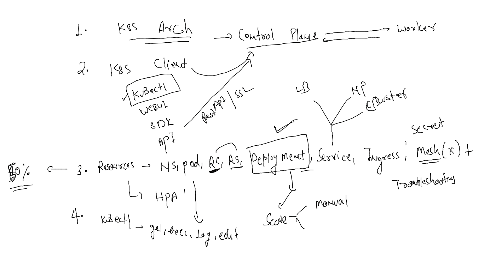

# aks-cka-training

## Discussion 



### how service find POds 

```
kubectl create  deploy d1  --image=nginx --port 80 --replicas=10
deployment.apps/d1 created
fire@ashutoshhs-MacBook-Air ~ % kubectl get  deploy 
NAME   READY   UP-TO-DATE   AVAILABLE   AGE
d1     0/10    10           0           5s
fire@ashutoshhs-MacBook-Air ~ % kubectl get  po     
NAME                 READY   STATUS              RESTARTS   AGE
d1-b4dc9c75b-6696n   0/1     ContainerCreating   0          8s
d1-b4dc9c75b-96lhw   0/1     ContainerCreating   0          8s
d1-b4dc9c75b-9bsrs   0/1     ContainerCreating   0          8s
d1-b4dc9c75b-cccrv   0/1     ContainerCreating   0          8s
d1-b4dc9c75b-gtbfs   0/1     ContainerCreating   0          8s
d1-b4dc9c75b-jsndj   0/1     ContainerCreating   0          8s
d1-b4dc9c75b-ld6gn   0/1     ContainerCreating   0          8s
d1-b4dc9c75b-n92lz   0/1     ContainerCreating   0          8s
d1-b4dc9c75b-pv576   0/1     ContainerCreating   0          8s
d1-b4dc9c75b-xv72j   0/1     ContainerCreating   0          8s
fire@ashutoshhs-MacBook-Air ~ % kubectl create  deploy d2  --image=httpd --port 80 --replicas=20
deployment.apps/d2 created
fire@ashutoshhs-MacBook-Air ~ % kubectl  get  deploy 
NAME   READY   UP-TO-DATE   AVAILABLE   AGE
d1     8/10    10           8           28s
d2     0/20    20           0           6s

```

### service create EndPoints to create routing rules of pod 


```
~ % kubectl get  svc
NAME         TYPE        CLUSTER-IP       EXTERNAL-IP   PORT(S)          AGE
kubernetes   ClusterIP   10.96.0.1        <none>        443/TCP          13d
s111         NodePort    10.110.94.184    <none>        1234:30377/TCP   56s
s1lb1        NodePort    10.107.124.192   <none>        80:30678/TCP     6m1s
fire@ashutoshhs-MacBook-Air ~ % kubectl get ep 
NAME         ENDPOINTS                                                              AGE
kubernetes   172.31.4.111:6443                                                      13d
s111         <none>                                                                 60s
s1lb1        192.168.166.135:80,192.168.166.136:80,192.168.166.137:80 + 7 more...   6m5s
```

### if you delete pod there dynamic routing will be automatically update EP 

```
kubectl  get  ep  
NAME         ENDPOINTS            AGE
kubernetes   172.31.4.111:6443    13d
s111         <none>               6m40s
s1lb1        192.168.166.143:80   11m
fire@ashutoshhs-MacBook-Air ~ % kubectl  get  po -owide
NAME                 READY   STATUS    RESTARTS   AGE   IP                NODE    NOMINATED NODE   READINESS GATES
d1-b4dc9c75b-xv72j   1/1     Running   0          14m   192.168.166.143   node1   <none>           <none>
d2-747f4fc95-zkf4w   1/1     Running   0          13m   192.168.166.159   node1   <none>           <none>
fire@ashutoshhs-MacBook-Air ~ % kubectl delete pod d1-b4dc9c75b-xv72j
pod "d1-b4dc9c75b-xv72j" deleted
fire@ashutoshhs-MacBook-Air ~ % kubectl  get  po -owide              
NAME                 READY   STATUS    RESTARTS   AGE   IP                NODE    NOMINATED NODE   READINESS GATES
d1-b4dc9c75b-4f5s2   1/1     Running   0          4s    192.168.166.165   node1   <none>           <none>
d2-747f4fc95-zkf4w   1/1     Running   0          13m   192.168.166.159   node1   <none>           <none>
fire@ashutoshhs-MacBook-Air ~ % kubectl  get  ep                     
NAME         ENDPOINTS            AGE
kubernetes   172.31.4.111:6443    13d
s111         <none>               7m11s
s1lb1        192.168.166.165:80   12m

```

