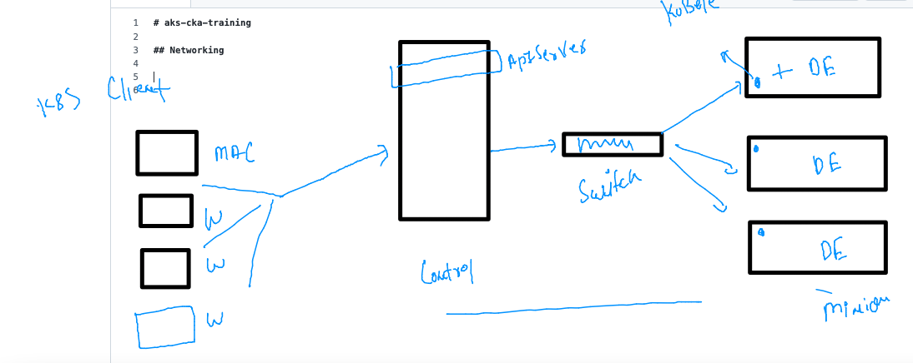
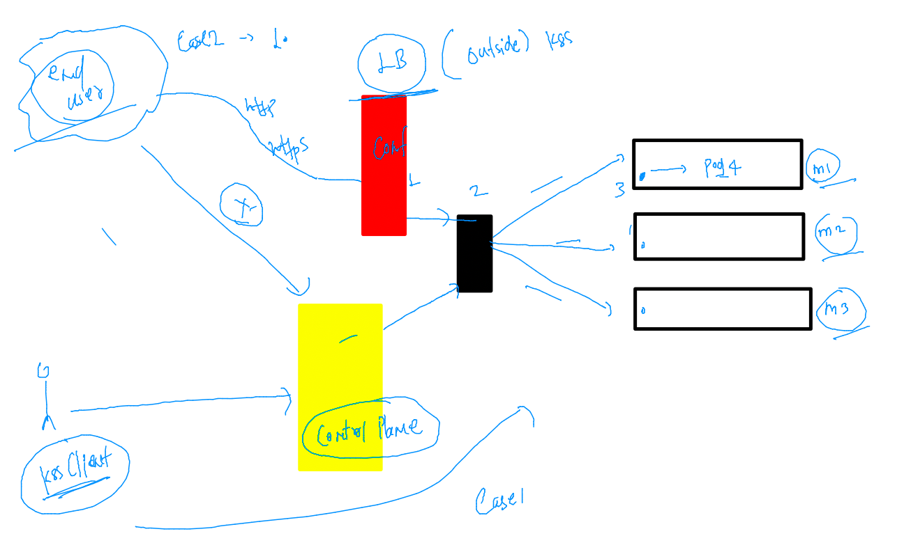
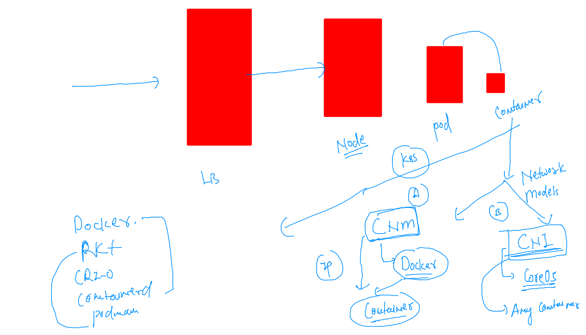
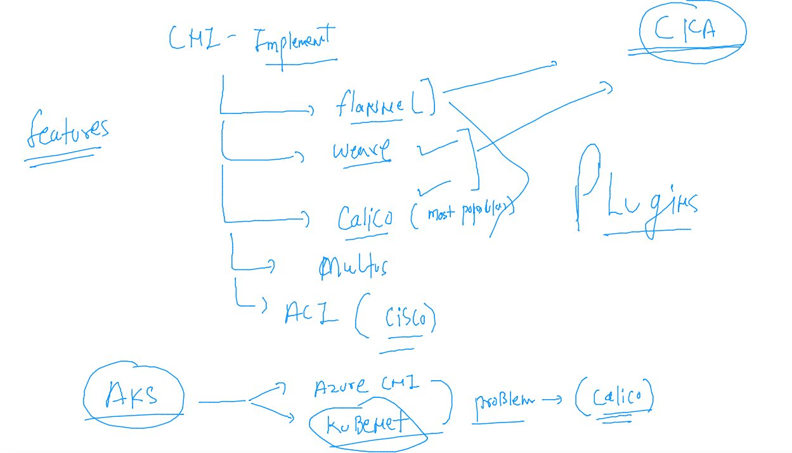
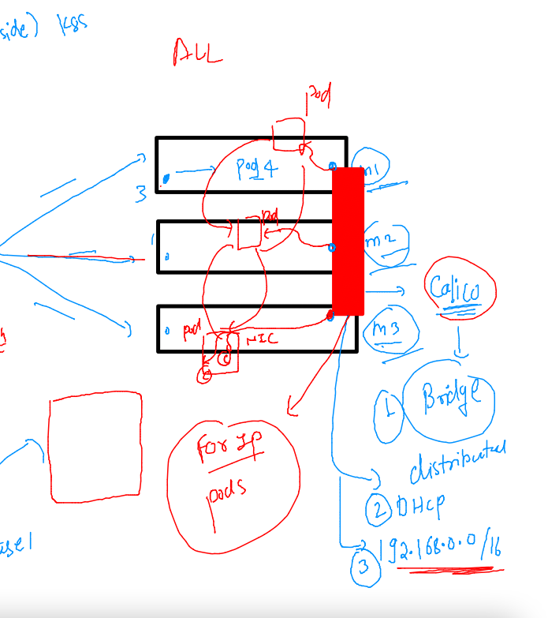

# aks-cka-training

## Networking 



## TO access application running in the pod 

### case 1 : when we are k8s client 

```
kubectl port-forward  ashupod1  1234:80 
Forwarding from 127.0.0.1:1234 -> 80
Forwarding from [::1]:1234 -> 80

```

### case2 : when we are not k8s client (we are end users)



### container network Interface (CNI)



### CNI more details 



### NEtwork bridge by CNI -- for pod networking 




