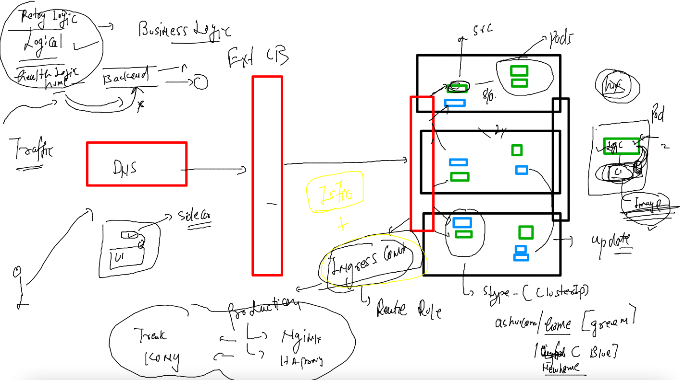

# aks-cka-training

### Ingress controller based app access 


### Istio as service mesh and Ingress controller / Ingress gateway (for istio)




### install Istio 

```
./istioctl   install 
This will install the Istio 1.13.4 default profile with ["Istio core" "Istiod" "Ingress gateways"] components into the cluster. Proceed? (y/N) y
✔ Istio core installed                                                                                             
✔ Istiod installed                                                                                                 
✔ Ingress gateways installed                                                                                       
✔ Installation complete                                                                                            Making this installation the default for injection and validation.

Thank you for installing Istio 1.13.  Please take a few minutes to tell us about your install/upgrade experience!  https://forms.gle/pzWZpAvMVBecaQ9h9
fire@node155:~/istio-1.13.4/bin$ kubectl  get  ns
NAME              STATUS   AGE
default           Active   99s
istio-system      Active   46s

```

