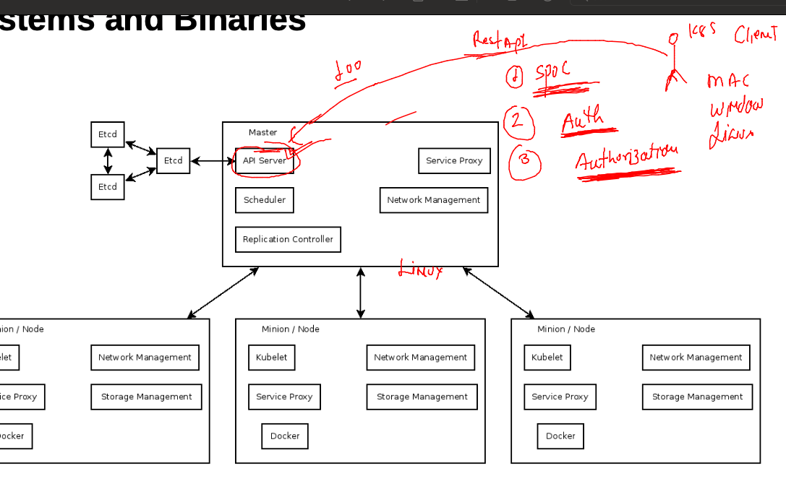
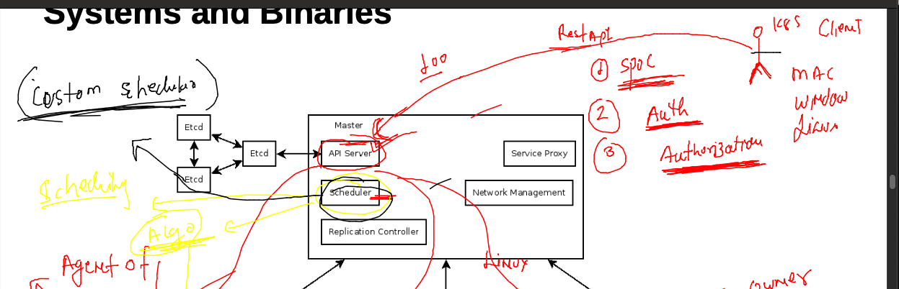
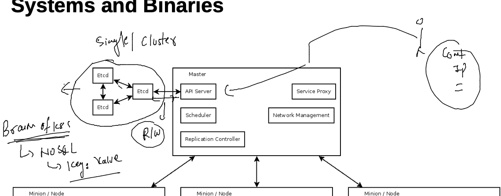
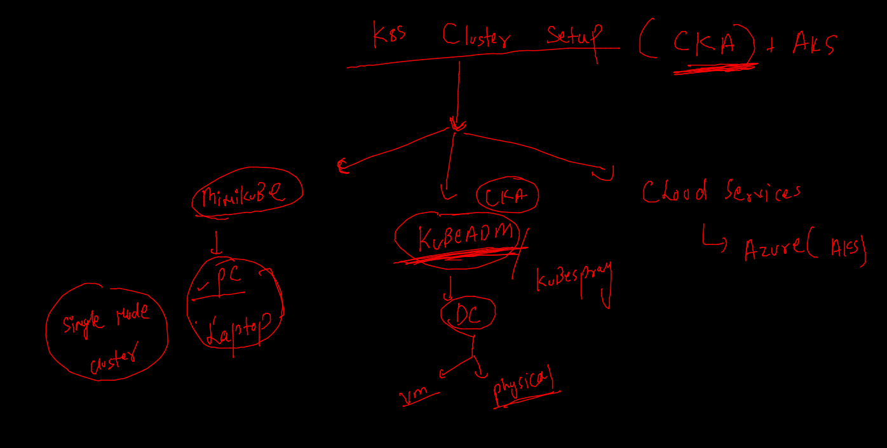

# aks-cka-training

## app image building and deploy in k8s 


### k8s arch level 1
 


## k8s master node components 

### kube-apiserver



### kube-schedular 



### etcd 



### cluster setup tech --



### to get auth token / kubeconfig file from k8s master --

### case 1 

### when we have master system in our control  (cka)

```
[root@ip-172-31-90-99 ~]# cd /etc/kubernetes/
[root@ip-172-31-90-99 kubernetes]# ls
admin.conf  controller-manager.conf  kubelet.conf  manifests  pki  scheduler.conf
[root@ip-172-31-90-99 kubernetes]# 

```
### when cloud is managing internally 
### after downloading kubeconfig file 

### check connection 

```
kubectl  get  nodes  --kubeconfig    admin.conf.txt 
NAME                           STATUS   ROLES                  AGE    VERSION
ip-172-31-85-52.ec2.internal   Ready    <none>                 5d9h   v1.23.4
ip-172-31-90-99.ec2.internal   Ready    control-plane,master   5d9h   v1.23.4


====

kubectl  cluster-info  --kubeconfig admin.conf.txt 
Kubernetes control plane is running at https://3.233.160.167:6443
CoreDNS is running at https://3.233.160.167:6443/api/v1/namespaces/kube-system/services/kube-dns:dns/proxy


```


