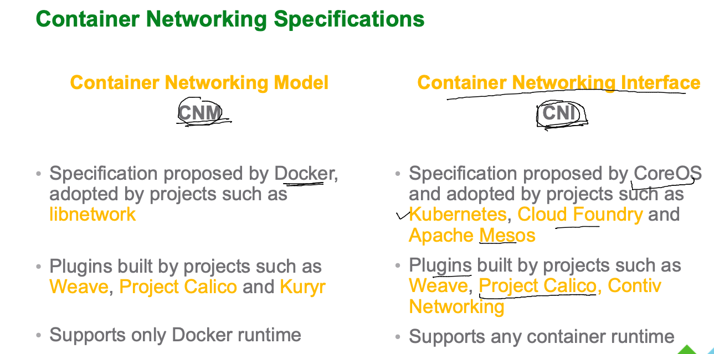
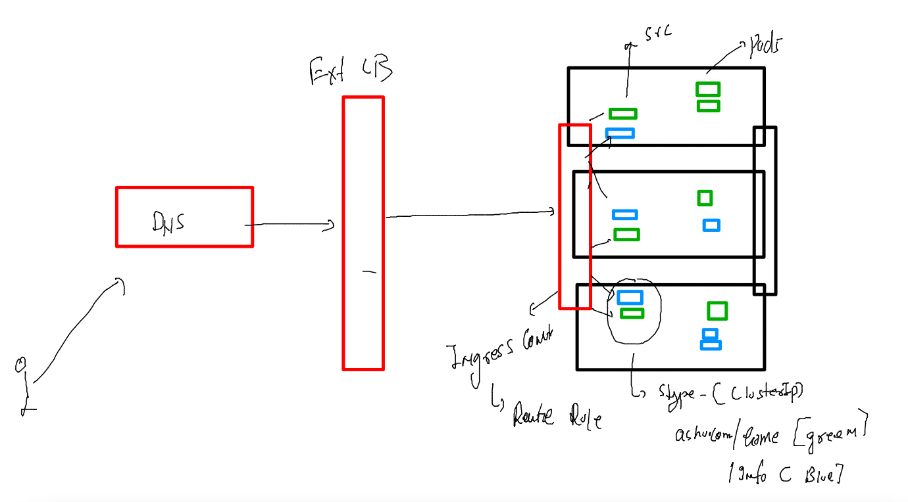

# aks-cka-training

### container networking models 



### service and Ingress 

```
 kubectl  run  ashuwebapp --image=nginx --port 80 
pod/ashuwebapp created
[root@master ~]# kubectl get po 
NAME         READY   STATUS    RESTARTS   AGE
ashupod1     1/1     Running   0          8m6s
ashuwebapp   1/1     Running   0          4s
[root@master ~]# kubectl expose pod ashuwebapp --type NodePort --port 80 --name lb1 
service/lb1 exposed
[root@master ~]# kubectl get svc
NAME         TYPE        CLUSTER-IP      EXTERNAL-IP   PORT(S)        AGE
ashulb1      NodePort    10.96.57.219    <none>        80:31247/TCP   23h
kubernetes   ClusterIP   10.96.0.1       <none>        443/TCP        24h
lb1          NodePort    10.100.143.43   <none>        80:30659/TCP   3s
[root@master ~]# kubectl expose pod ashuwebapp --type LoadBalancer --port 80 --name lb2
service/lb2 exposed
[root@master ~]# 
[root@master ~]# kubectl get svc
NAME         TYPE           CLUSTER-IP      EXTERNAL-IP   PORT(S)        AGE
ashulb1      NodePort       10.96.57.219    <none>        80:31247/TCP   23h
kubernetes   ClusterIP      10.96.0.1       <none>        443/TCP        24h
lb1          NodePort       10.100.143.43   <none>        80:30659/TCP   33s
lb2          LoadBalancer   10.96.111.252   <pending>     80:31944/TCP   3s

```

### Ingress 



