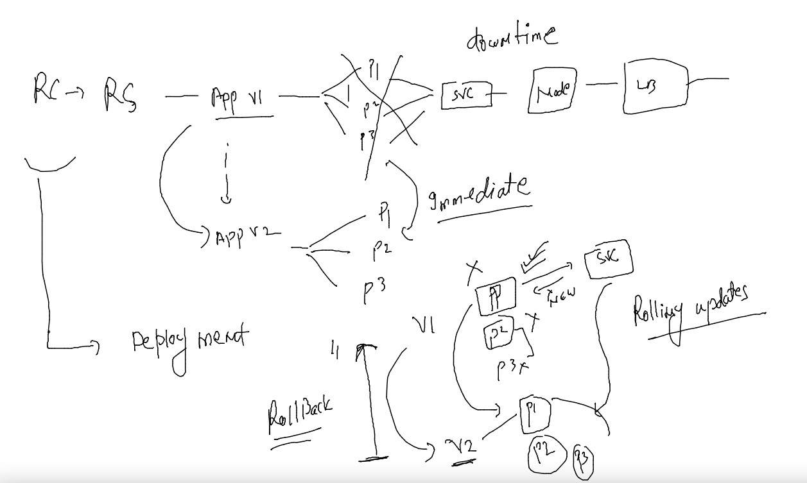
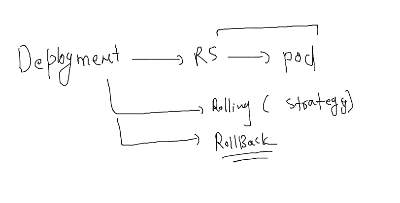

# aks-cka-training

## Deployment 



### one level down 



### creating new docker image and push it to docker hub 

```
docker build -t  dockerashu/aksapp:v1 https://github.com/redashu/HCLwebapp.git 
Sending build context to Docker daemon   38.4kB
Step 1/3 : FROM nginx
 ---> 0e901e68141f
Step 2/3 : LABEL name=ashutoshh
 ---> Running in e9fb0a2875c1
Removing intermediate container e9fb0a2875c1
 ---> abe697d30889
Step 3/3 : COPY . /usr/share/nginx/html/
 ---> 894a93df70ee
Successfully built 894a93df70ee
Successfully tagged dockerashu/aksapp:v1
fire@node155:~/images$ docker login 
Authenticating with existing credentials...
WARNING! Your password will be stored unencrypted in /home/fire/.docker/config.json.
Configure a credential helper to remove this warning. See
https://docs.docker.com/engine/reference/commandline/login/#credentials-store

Login Succeeded
fire@node155:~/images$ docker push dockerashu/aksapp:v1
The push refers to repository [docker.io/dockerashu/aksapp]
822323dd2b76: Pushing [==================================================>]   38.4kB
33e3df466e11: Preparing 
747b7a567071: Preparing 


```
### deploy 

```
kubectl create deployment webapp --image=dockerashu/aksapp:v1 --port 80  --dry-run=client  -o yaml  >deploy.yaml 
fire@ashutoshhs-MacBook-Air deployment % 
fire@ashutoshhs-MacBook-Air deployment % 
fire@ashutoshhs-MacBook-Air deployment % vim deploy.yaml 
fire@ashutoshhs-MacBook-Air deployment % kubectl create -f deploy.yaml 
deployment.apps/webapp created
fire@ashutoshhs-MacBook-Air deployment % kubectl get deployment 
NAME     READY   UP-TO-DATE   AVAILABLE   AGE
d1       1/1     1            1           23h
d2       1/1     1            1           23h
webapp   0/1     1            0           6s

```

### --

```
kubectl expose deploy webapp --type LoadBalancer --port 80 --name lb1 
service/lb1 exposed
fire@ashutoshhs-MacBook-Air deployment % kubectl  get  svc
NAME         TYPE           CLUSTER-IP       EXTERNAL-IP   PORT(S)        AGE
kubernetes   ClusterIP      10.96.0.1        <none>        443/TCP        9s
lb1          LoadBalancer   10.100.224.157   <pending>     80:30378/TCP   4s
```
### checking more deploy 

```
kubectl  describe deploy  webapp 
Name:                   webapp
Namespace:              default
CreationTimestamp:      Tue, 14 Jun 2022 07:47:11 +0530
Labels:                 app=webapp
Annotations:            deployment.kubernetes.io/revision: 1
Selector:               app=webapp
Replicas:               1 desired | 1 updated | 1 total | 1 available | 0 unavailable
StrategyType:           RollingUpdate
MinReadySeconds:        0
RollingUpdateStrategy:  25% max unavailable, 25% max surge
```

### manual scaling 

```
kubectl  scale deploy webapp --replicas=5
deployment.apps/webapp scaled
fire@ashutoshhs-MacBook-Air deployment % kubectl  get deploy                      
NAME     READY   UP-TO-DATE   AVAILABLE   AGE
webapp   1/5     5            1           4m37s
fire@ashutoshhs-MacBook-Air deployment % kubectl  get po --show-labels -owide
NAME                      READY   STATUS    RESTARTS   AGE     IP                NODE    NOMINATED NODE   READINESS GATES   LABELS
webapp-6849787f49-ft2mv   1/1     Running   0          10s     192.168.166.173   node1   <none>           <none>            app=webapp,pod-template-hash=6849787f49
webapp-6849787f49-g7xwk   1/1     Running   0          4m45s   192.168.166.169   node1   <none>           <none>            app=webapp,pod-template-hash=6849787f49
webapp-6849787f49-jq2jp   1/1     Running   0          10s     192.168.166.170   node1   <none>           <none>            app=webapp,pod-template-hash=6849787f49
webapp-6849787f49-kkwv2   1/1     Running   0          10s     192.168.166.171   node1   <none>           <none>            app=webapp,pod-template-hash=6849787f49
webapp-6849787f49-wx5l5   1/1     Running   0          10s     192.168.166.172   node1   <none>           <none>            app=webapp,pod-template-hash=6849787f49
fire@ashutoshhs-MacBook-Air deployment % kubectl  get po --show-labels       
NAME                      READY   STATUS    RESTARTS   AGE     LABELS
webapp-6849787f49-ft2mv   1/1     Running   0          18s     app=webapp,pod-template-hash=6849787f49
webapp-6849787f49-g7xwk   1/1     Running   0          4m53s   app=webapp,pod-template-hash=6849787f49
webapp-6849787f49-jq2jp   1/1     Running   0          18s     app=webapp,pod-template-hash=6849787f49
webapp-6849787f49-kkwv2   1/1     Running   0          18s     app=webapp,pod-template-hash=6849787f49
webapp-6849787f49-wx5l5   1/1     Running   0          18s     app=webapp,pod-template-hash=6849787f49

```

### update deploy 

```
 kubectl  set image deploy webapp  aksapp=dockerashu/aksapp:v2 
```

### checking revision history 

```
 kubectl rollout  status deploy webapp
deployment "webapp" successfully rolled out
fire@ashutoshhs-MacBook-Air deployment % kubectl rollout  history  deploy webapp 
deployment.apps/webapp 
REVISION  CHANGE-CAUSE
1         <none>
2         <none>

```

### rolling backup 

```
kubectl rollout  undo   deploy webapp 
deployment.apps/webapp rolled back
fire@ashutoshhs-MacBook-Air deployment % kubectl rollout  status deploy webapp   
Waiting for deployment "webapp" rollout to finish: 4 out of 5 new replicas have been updated...
Waiting for deployment "webapp" rollout to finish: 1 old replicas are pending termination...
Waiting for deployment "webapp" rollout to finish: 1 old replicas are pending termination...
Waiting for deployment "webapp" rollout to finish: 1 old replicas are pending termination...
Waiting for deployment "webapp" rollout to finish: 4 of 5 updated replicas are available...
deployment "webapp" successfully rolled out

```

