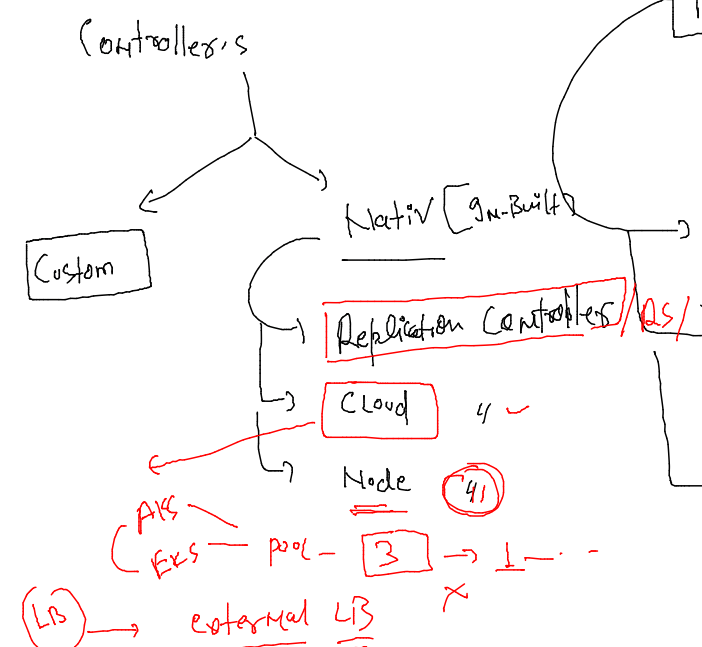
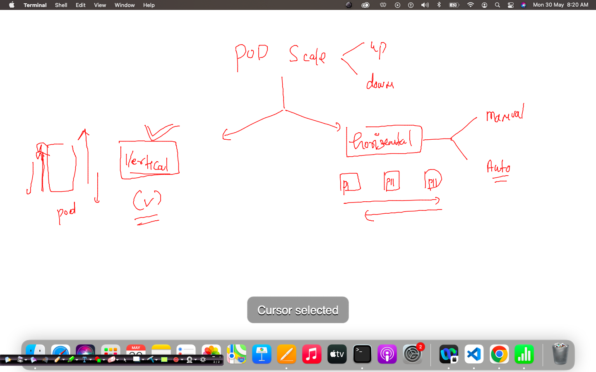

# aks-cka-training

## Controller 

### problem with POD 


### controllers to solve problems 



## RC 

### YAML 

```
fire@node155:/tmp/RC$ cat  rc.yaml 
apiVersion: v1
kind: ReplicationController
metadata:
 name: ashu-rc-1 
 labels: # label of RC 
  x1: hello
spec: 
 replicas: 1 # number of pods we need 
 template: 
  metadata:
   labels: # label of pods 
    run: webpod1
  #name: webpod1  we don't need name bcz rc will create it automatically 
  spec:
   containers:
   - image: nginx
     name: webpod1
     ports:
     - containerPort: 80
     resources: {}

```

### Deploy rc file 

```
kubectl apply -f  rc.yaml 
replicationcontroller/ashu-rc-1 created
fire@node155:/tmp/RC$ kubectl   get  rc
NAME        DESIRED   CURRENT   READY   AGE
ashu-rc-1   1         1         0       3s
fire@node155:/tmp/RC$ kubectl   get  po
NAME              READY   STATUS              RESTARTS   AGE
ashu-rc-1-57vvp   0/1     ContainerCreating   0          12s
fire@node155:/tmp/RC$ kubectl   get  po
NAME              READY   STATUS    RESTARTS   AGE
ashu-rc-1-57vvp   1/1     Running   0          24s
fire@node155:/tmp/RC$ 

```

### Recreation 

```
 kubectl delete pod  ashu-rc-1-57vvp
pod "ashu-rc-1-57vvp" deleted
fire@node155:/tmp/RC$ kubectl  get po 
NAME              READY   STATUS    RESTARTS   AGE
ashu-rc-1-zd597   1/1     Running   0          9s
fire@node155:/tmp/RC$ kubectl  get po  -owide
NAME              READY   STATUS    RESTARTS   AGE   IP           NODE           NOMINATED NODE   READINESS GATES
ashu-rc-1-zd597   1/1     Running   0          22s   172.17.0.2   minikube-m02   <none>           <none>
fire@node155:/tmp/RC$ kubectl delete pod  ashu-rc-1-zd597
pod "ashu-rc-1-zd597" deleted
fire@node155:/tmp/RC$ 
fire@node155:/tmp/RC$ 
fire@node155:/tmp/RC$ kubectl  get po  -owide
NAME              READY   STATUS    RESTARTS   AGE   IP           NODE           NOMINATED NODE   READINESS GATES
ashu-rc-1-zd8w8   1/1     Running   0          7s    172.17.0.2   minikube-m02   <none>           <none>
fire@node155:/tmp/RC$ kubectl get no
NAME           STATUS   ROLES                  AGE   VERSION
minikube       Ready    control-plane,master   39h   v1.23.3
minikube-m02   Ready    <none>                 13m   v1.23.3
```

### scaling in pod 



### Method 1 -- changing replicas field in YAML 

```
 vim rc.yaml 
fire@node155:/tmp/RC$ kubectl apply -f  rc.yaml 
replicationcontroller/ashu-rc-1 configured
fire@node155:/tmp/RC$ kubectl  get rc
NAME        DESIRED   CURRENT   READY   AGE
ashu-rc-1   2         2         1       7m20s
fire@node155:/tmp/RC$ kubectl  get po
NAME              READY   STATUS              RESTARTS   AGE
ashu-rc-1-kj6vb   0/1     ContainerCreating   0          11s
ashu-rc-1-zd8w8   1/1     Running             0          4m58s
fire@node155:/tmp/RC$ kubectl  get rc
NAME        DESIRED   CURRENT   READY   AGE
ashu-rc-1   2         2         1       7m31s
fire@node155:/tmp/RC$ kubectl  get po
NAME              READY   STATUS    RESTARTS   AGE
ashu-rc-1-kj6vb   1/1     Running   0          21s
ashu-rc-1-zd8w8   1/1     Running   0          5m8s
fire@node155:/tmp/RC$ kubectl  get rc
NAME        DESIRED   CURRENT   READY   AGE
ashu-rc-1   2         2         2       7m39s
fire@node155:/tmp/RC$ 

```

### directly changing into ETCD database 

```
kubectl  scale  rc  ashu-rc-1  --replicas=3
replicationcontroller/ashu-rc-1 scaled
fire@node155:/tmp/RC$ kubectl  get rc
NAME        DESIRED   CURRENT   READY   AGE
ashu-rc-1   3         3         2       8m36s
fire@node155:/tmp/RC$ kubectl  get rc
NAME        DESIRED   CURRENT   READY   AGE
ashu-rc-1   3         3         3       8m51s
fire@node155:/tmp/RC$ kubectl  get po
NAME              READY   STATUS    RESTARTS   AGE
ashu-rc-1-kj6vb   1/1     Running   0          98s
ashu-rc-1-nvj46   1/1     Running   0          20s
ashu-rc-1-zd8w8   1/1     Running   0          6m25s
```

### editing etcd db yaml 

```
 kubectl  edit  rc  ashu-rc-1
replicationcontroller/ashu-rc-1 edited
fire@node155:/tmp/RC$ kubectl  get rc
NAME        DESIRED   CURRENT   READY   AGE
ashu-rc-1   4         4         3       13m
fire@node155:/tmp/RC$ kubectl  get rc
NAME        DESIRED   CURRENT   READY   AGE
ashu-rc-1   4         4         4       13m
fire@node155:/tmp/RC$ kubectl  get po
NAME              READY   STATUS    RESTARTS   AGE
ashu-rc-1-kj6vb   1/1     Running   0          6m34s
ashu-rc-1-nvj46   1/1     Running   0          5m16s
ashu-rc-1-p968n   1/1     Running   0          10s
ashu-rc-1-zd8w8   1/1     Running   0          11m
fire@node155:/tmp/RC$ kubectl  get po -owide
NAME              READY   STATUS    RESTARTS   AGE     IP           NODE           NOMINATED NODE   READINESS GATES
ashu-rc-1-kj6vb   1/1     Running   0          6m38s   172.17.0.5   minikube       <none>           <none>
ashu-rc-1-nvj46   1/1     Running   0          5m20s   172.17.0.3   minikube-m02   <none>           <none>
ashu-rc-1-p968n   1/1     Running   0          14s     172.17.0.6   minikube       <none>           <none>
ashu-rc-1-zd8w8   1/1     Running   0          11m     172.17.0.2   minikube-m02   <none>           <none>
fire@node155:/tmp/RC$ 

```

### creating svc

```

fire@node155:/tmp/RC$ kubectl  get po --show-labels
NAME              READY   STATUS    RESTARTS   AGE     LABELS
ashu-rc-1-kj6vb   1/1     Running   0          8m1s    run=webpod1
ashu-rc-1-nvj46   1/1     Running   0          6m43s   run=webpod1
ashu-rc-1-p968n   1/1     Running   0          97s     run=webpod1
ashu-rc-1-zd8w8   1/1     Running   0          12m     run=webpod1
fire@node155:/tmp/RC$ 
fire@node155:/tmp/RC$ kubectl  get rc
NAME        DESIRED   CURRENT   READY   AGE
ashu-rc-1   4         4         4       15m
fire@node155:/tmp/RC$ kubectl expose rc  ashu-rc-1  --type NodePort --port 80 --name lb1 
service/lb1 exposed

```

===

```
kubectl  get  svc -owide
NAME         TYPE        CLUSTER-IP       EXTERNAL-IP   PORT(S)        AGE   SELECTOR
kubernetes   ClusterIP   10.96.0.1        <none>        443/TCP        39h   <none>
lb1          NodePort    10.108.101.199   <none>        80:31578/TCP   79s   run=webpod1
fire@node155:/tmp/RC$ 


```

