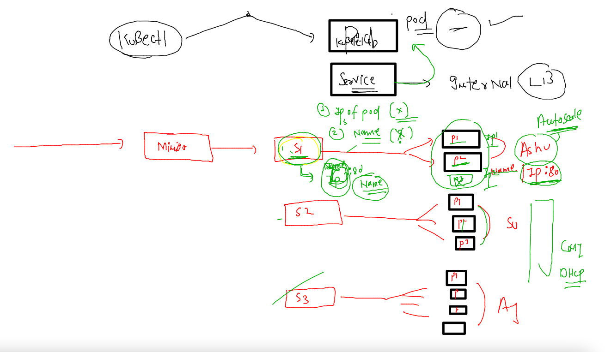

# aks-cka-training

## K8s networking 

### Intro to service in k8s 


### service can't user ip or name of pod for connection purpose 



### service gonna user labels of pod to find 


### checking labels 

```
fire@ashutoshhs-MacBook-Air ~ % kubectl  get pods  --show-labels
NAME          READY   STATUS    RESTARTS   AGE   LABELS
ajeetpodnew   1/1     Running   0          30m   run=ajeetpodnew
ashupodew     1/1     Running   0          30m   run=ashupodew
surbhipod     1/1     Running   0          27m   run=surbhipod
fire@ashutoshhs-MacBook-Air ~ % kubectl  get pods ashupodew  --show-labels
NAME        READY   STATUS    RESTARTS   AGE   LABELS
ashupodew   1/1     Running   0          31m   run=ashupodew
```

### service type in k8s


### Nodeport type 


### creating nodeport service 

```
kubectl  create  service   nodeport  ashusvc1   --tcp  1234:80   --dry-run=client -o yaml
```

```
fire@ashutoshhs-MacBook-Air ~ % kubectl  get no
NAME                            STATUS   ROLES                  AGE   VERSION
ip-172-31-29-225.ec2.internal   Ready    <none>                 10h   v1.23.5
ip-172-31-85-52.ec2.internal    Ready    <none>                 21d   v1.23.4
ip-172-31-90-99.ec2.internal    Ready    control-plane,master   21d   v1.23.4
fire@ashutoshhs-MacBook-Air ~ % kubectl  get pods  --show-labels
NAME          READY   STATUS    RESTARTS   AGE   LABELS
ajeetpodnew   1/1     Running   0          58m   run=ajeetpodnew
ashupod999    1/1     Running   0          23m   x=hello,y1=hii
ashupodew     1/1     Running   0          59m   run=ashupodew
surbhipod     1/1     Running   0          56m   run=surbhipod
fire@ashutoshhs-MacBook-Air ~ % kubectl  get svc                
NAME         TYPE        CLUSTER-IP       EXTERNAL-IP   PORT(S)          AGE
ashusvc1     NodePort    10.107.229.222   <none>        1234:31100/TCP   9s
kubernetes   ClusterIP   10.96.0.1        <none>        443/TCP          10h
fire@ashutoshhs-MacBook-Air ~ % 


```
