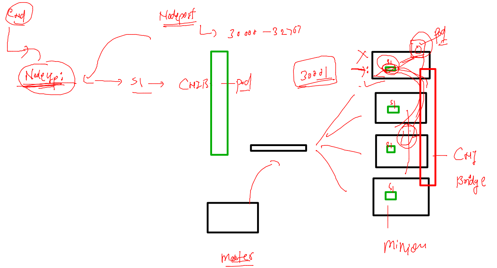
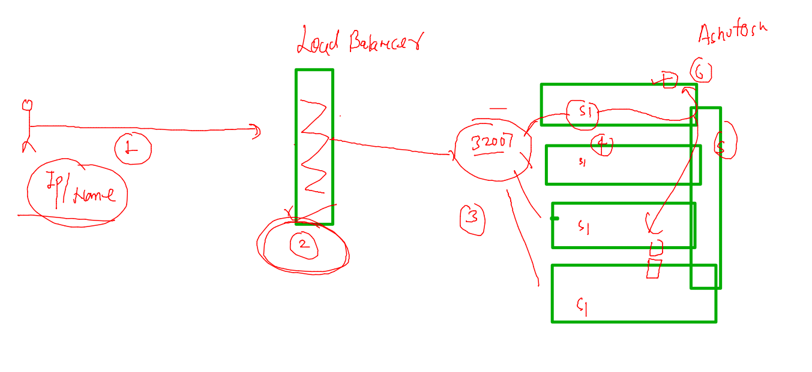

# aks-cka-training

## NodePOrt revision 



### checking label of pods 

```
fire@ashutoshhs-MacBook-Air ~ % kubectl  get  po --show-labels
NAME       READY   STATUS    RESTARTS   AGE   LABELS
ashupod1   1/1     Running   0          85s   run=ashupod1
manojpod   1/1     Running   0          28s   run=manojpod

```

### creating service by expose command 

```
 kubectl expose pod  ashupod1  --type NodePort --port 1234 --target-port 80 --name ashusvc1
service/ashusvc1 exposed
fire@ashutoshhs-MacBook-Air ~ % kubectl get svc
NAME         TYPE        CLUSTER-IP       EXTERNAL-IP   PORT(S)          AGE
ashusvc1     NodePort    10.110.227.232   <none>        1234:32449/TCP   4s
kubernetes   ClusterIP   10.96.0.1        <none>        443/TCP          5m16s
fire@ashutoshhs-MacBook-Air ~ % kubectl get  po --show-labels                                                             
NAME           READY   STATUS    RESTARTS   AGE     LABELS
ajeetpod       1/1     Running   0          2m53s   run=ajeetpod
ashupod1       1/1     Running   0          4m33s   run=ashupod1
manojpod       1/1     Running   0          3m36s   run=manojpod
surbhinewpod   1/1     Running   0          2m50s   run=surbhinewpod
fire@ashutoshhs-MacBook-Air ~ % kubectl get svc -owide       
NAME         TYPE        CLUSTER-IP       EXTERNAL-IP   PORT(S)          AGE     SELECTOR
ashusvc1     NodePort    10.110.227.232   <none>        1234:32449/TCP   16s     run=ashupod1
kubernetes   ClusterIP   10.96.0.1        <none>        443/TCP          5m28s   <none>
fire@ashutoshhs-MacBook-Air ~ % 

```

### external LB in k8s 



### namespaces 

```
 
fire@ashutoshhs-MacBook-Air ~ % kubectl  get ns
NAME              STATUS   AGE
default           Active   25d
kube-node-lease   Active   2m3s
kube-public       Active   25d
kube-system       Active   25d

```

### creating ns 

```
 kubectl create  namespace  ashu-project                         
namespace/ashu-project created
fire@ashutoshhs-MacBook-Air ~ % kubectl  get  ns
NAME              STATUS   AGE
ashu-project      Active   4s
default           Active   25d
kube-node-lease   Active   2m51s
kube-public       Active   25d
kube-system       Active   25d

```

### changing namespace on client side

```
 kubectl  get  po
No resources found in default namespace.
fire@ashutoshhs-MacBook-Air ~ % 
fire@ashutoshhs-MacBook-Air ~ % kubectl  config set-context --current --namespace ashu-project 
Context "kubernetes-admin@kubernetes" modified.
fire@ashutoshhs-MacBook-Air ~ % 
fire@ashutoshhs-MacBook-Air ~ % kubectl  get  po                                               
No resources found in ashu-project namespace.
fire@ashutoshhs-MacBook-Air ~ % 

```

### 

```
 kubectl config get-contexts
CURRENT   NAME                          CLUSTER        AUTHINFO                             NAMESPACE
          aks-training                  aks-training   clusterUser_aks-final_aks-training   
*         kubernetes-admin@kubernetes   kubernetes     kubernetes-admin                     ashu-project
fire@ashutoshhs-MacBook-Air ~ % 


```

