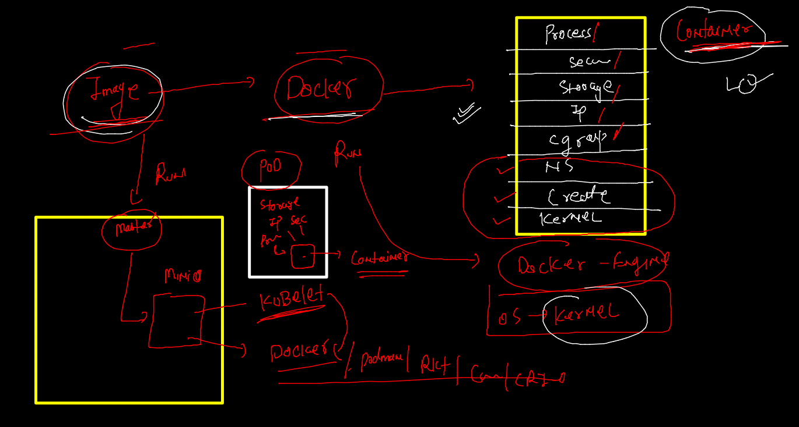

# aks-cka-training

## setting client 

```
fire@ashutoshhs-MacBook-Air Desktop % kubectl  --kubeconfig admin.conf    get nodes
NAME                           STATUS   ROLES                  AGE    VERSION
ip-172-31-85-52.ec2.internal   Ready    <none>                 6d9h   v1.23.4
ip-172-31-90-99.ec2.internal   Ready    control-plane,master   6d9h   v1.23.4
fire@ashutoshhs-MacBook-Air Desktop % 
fire@ashutoshhs-MacBook-Air Desktop % 
fire@ashutoshhs-MacBook-Air Desktop % 
fire@ashutoshhs-MacBook-Air Desktop % 
fire@ashutoshhs-MacBook-Air Desktop % mkdir  ~/.kube
mkdir: /Users/fire/.kube: File exists
fire@ashutoshhs-MacBook-Air Desktop % cp admin.conf  ~/.kube/config 
fire@ashutoshhs-MacBook-Air Desktop % 
fire@ashutoshhs-MacBook-Air Desktop % 
fire@ashutoshhs-MacBook-Air Desktop % 
fire@ashutoshhs-MacBook-Air Desktop % kubectl get nodes                            
NAME                           STATUS   ROLES                  AGE    VERSION
ip-172-31-85-52.ec2.internal   Ready    <none>                 6d9h   v1.23.4
ip-172-31-90-99.ec2.internal   Ready    control-plane,master   6d9h   v1.23.4

```

### deploy app in k8s process 


### how docker engine creates container 


### how k8s deploy app 



